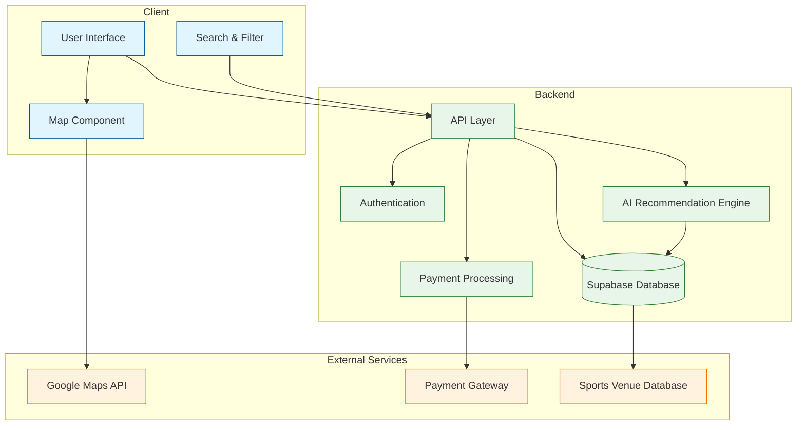

# SportSpot - Intelligent Sports Venue Discovery Platform

## Overview
SportSpot is an AI-powered application designed to help users discover and book sports venues across the United States. The platform seamlessly connects sports enthusiasts with local facilities, providing real-time availability, detailed venue information, and intelligent recommendations.

## System Architecture


## 🌟 Key Features
- **Smart Venue Discovery**: AI-powered search and recommendation system for finding sports facilities
- **Interactive Maps**: Integrated mapping system for location-based venue searches
- **Real-time Availability**: Up-to-date scheduling and booking system
- **Secure Payments**: Integrated payment processing for venue reservations
- **User Reviews**: Community-driven ratings and reviews for venues
- **Profile Management**: Personalized user profiles and preferences
- **Advanced Filtering**: Multi-parameter search with sport-specific filters

## 🛠️ Technology Stack
- **Frontend**:
  - HTML5
  - Vanilla JavaScript
  - TailwindCSS
  - DaisyUI
- **Backend**:
  - Supabase (Database & Authentication)
- **Deployment**:
  - Render

## 🚀 Getting Started

### Prerequisites
- Node.js (v14 or higher)
- npm or yarn package manager
- Supabase account
- Google Maps API key

### Installation
1. Clone the repository
```bash
git clone https://github.com/georgebfreeman/client-sports-facilities.git
cd client-sports-facilities
```

2. Install dependencies
```bash
npm install
npm run dev
```

3. Configure environment variables
```bash
cp .env.example .env
# Add your Supabase and Google Maps API credentials
```

4. Start the development server
```bash
npm run dev
```

## 📝 Environment Variables
```
SUPABASE_URL=your_supabase_url
SUPABASE_ANON_KEY=your_supabase_key
GOOGLE_MAPS_API_KEY=your_google_maps_key
```

## 🤝 Contributing
We welcome contributions! Please see our contributing guidelines for more details.

## 📄 License
This project is licensed under the MIT License - see the LICENSE file for details.